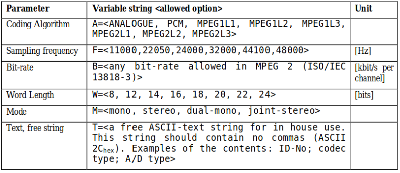

# UW BEXT Metadata Requirements

### Mandatory BEXT Fields
* Description 
* Originator 
* OriginatorReference 
* OriginationDate 
* OriginationTime 
* CodingHistory 
* IARL 

### Other Mandatory Fields
* Audio stream MD5

### Field Specific Instructions

Field|Requirements|Example
---|---|---
Description|[See details](#description)|[See details](#description
Originator|ISIL [MARC code](https://www.loc.gov/marc/organizations/org-search.php) for managing organization|US-wau
OriginatorReference|Original file name (minus extension). If greater than 32 characters use “See description for identifiers”|wauar_1693-001-jacobs_14553_side1 
OriginationDate|YYYY-MM-DD|2018-07-23
OriginationTime|HH:MM:SS|15:31:37
CodingHistory|[See details](#coding-history)|[See details](#coding-history)
IARL|ISIL MARC code for managing organization|US-wau 
MD5|MD5 Hash generated from PCM portion of file|6f5902ac237024bdd0c176cb93063dc4

### Detailed Requirements
#### Description
Contains necessary information to associate external metadata as well as physical item to digital proxy. This takes the form of:
`Collection # (OCLC): [OCLC Number], Collection # (UW): [UW Collection #], Item # (UW) [Jacobs Acc. Number], Original File Name: [Original File Name]` 

Collection OCLC Numbers (if present) can be found by searching for the collection record in the [UW Libraries' main catalog](https://alliance-primo.hosted.exlibrisgroup.com/primo-explore/search?vid=UW&tab=default_tab).

__Example:__ `
Collection # (OCLC): 28412834, Collection # (UW): 1693-001, Item # (UW) 14580, Original File Name: wauar_1693-001-jacobs_14580_side1`

#### Coding History
Contains history about the analog to digital conversion process conforming with [EBU Technical Recommendation R98-1999](https://tech.ebu.ch/docs/r/r098.pdf). 

Two lines are required, the first describing the analog playback and the second describing the digital capture. This takes the form of: 
> A=Encoding,M=Track arrangement,T=Playback Machine; Serial Number; Playback Speed; Format
> A=Encoding,F=Sample rate,W=Bit depth,M=Track arrangement,T=A/D Converter Brand; A/D Converter Model; Serial number; A/D

__Example:__
> A=Analog,M=stereo,T=Nakamichi CR-2A; SNA32517619; 1.875 ips; compact cassette tape
> A=PCM,F=96000,W=24,M=stereo,T=Apogee; Element 24; SNM2N110165200321; A/D
