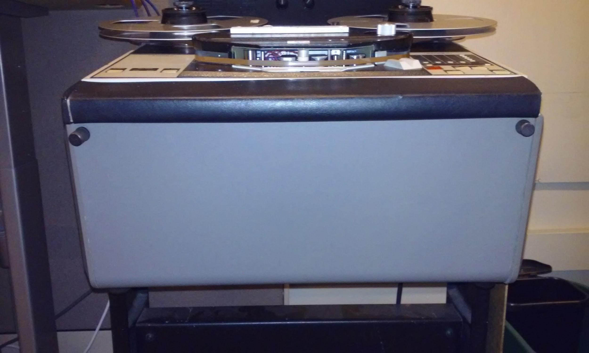
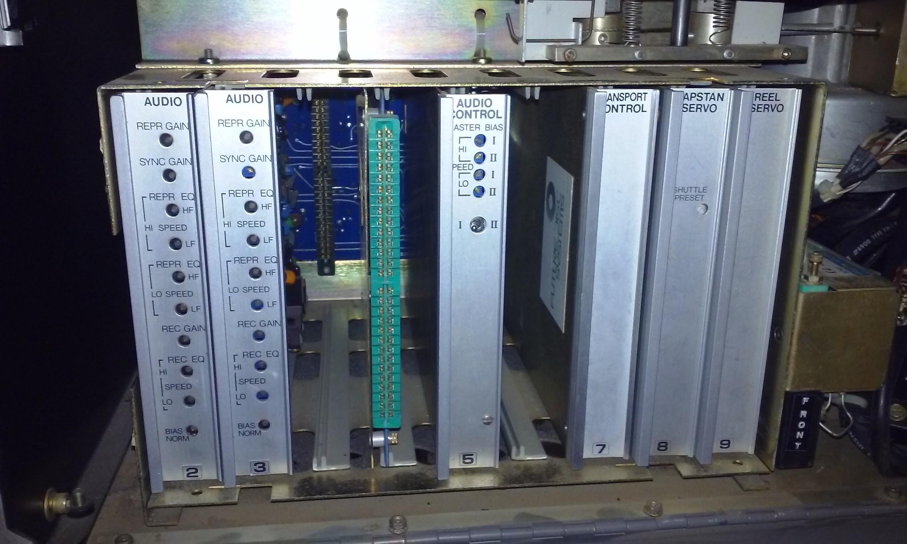
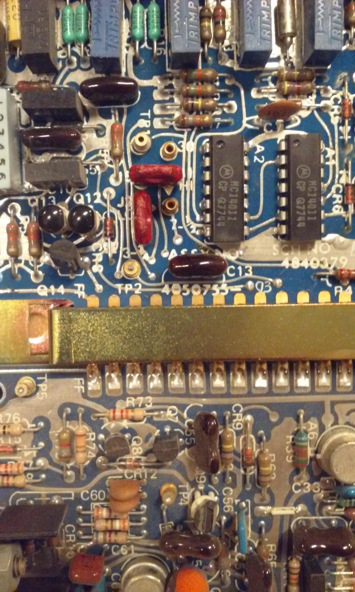
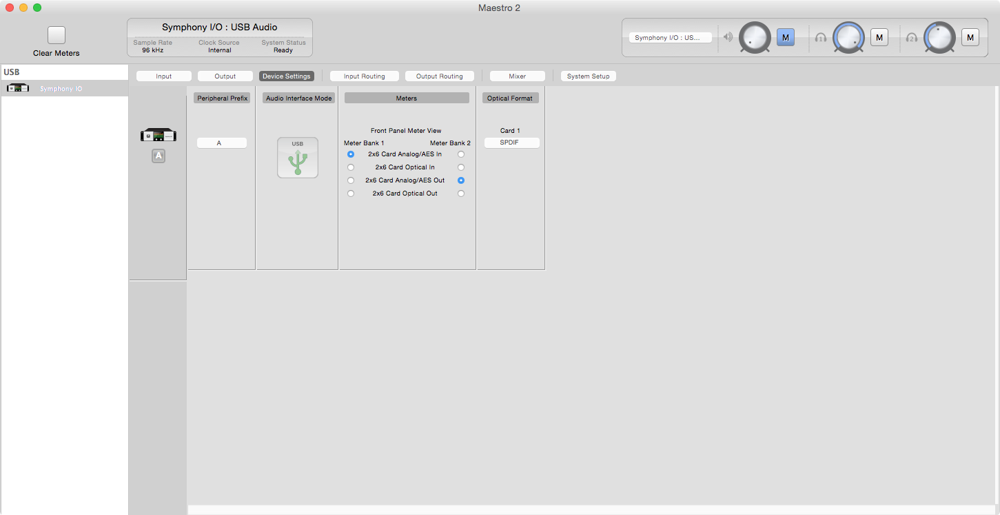
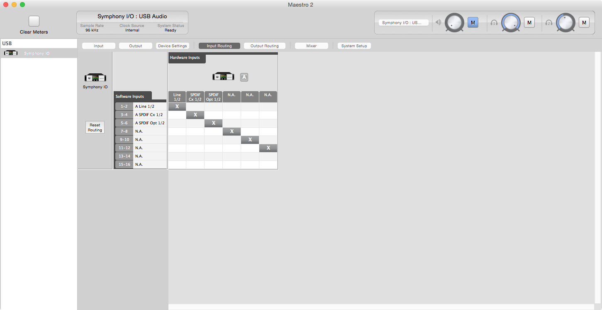
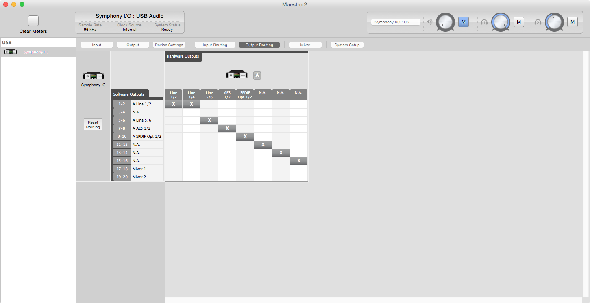
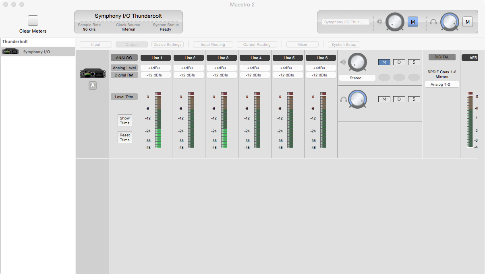
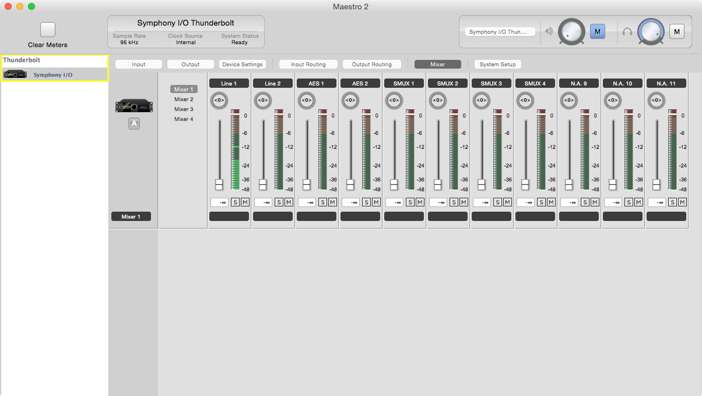

**UW LIBRARIES MEDIA CENTER**

Open Reel (Reel to Reel) Tape Digitization Guide

(Created Summer 2011, edited Summer 2014, Summer 2016)

**DIGITIZATION STEPS**

1. Tape Selection & Spreadsheets

2. Tape Inspection & Preparations (e.g. determine tape condition, add leader)

3. Playback Preparations (e.g. choose tape machine, clean, prepare tape, load tape onto machine)

4. Recording Preparations (e.g. open programs, check levels, name file w/ correct conventions)

5. Recording/Digitization & Monitoring (start recording,monitor levels)

6. Editing & Exporting/Bouncing (e.g. trim file accordingly, check digitization file,)

7. Tape Storage

8. Updating Spreadsheets

9. Updating BWF metadata (using "BWF MetaEdit" application)

10. Finishing up (close WaveLab, cleaning up, shutting off equipment, etc)

**1. TAPE SELECTION & SPREADSHEETS**

o **Selection:** Below is a list of things to be aware of when selecting tapes for digitization.

o **Prior Digitization:** Has this tape been digitized before? (More about this below)

o **Tape Condition:** Is the tape in good enough condition to be played even once?

o If relevant, perform a **pre-digitization "Rights" search:** Is the recording available commercially already? Does the tape, artist, or recording have important local or regional significance? Is the tape a complete mystery even after searching online and on WorldCat?  See relevant documentation for the detailed rights search checklist.  Update the data sheets as needed to document this search.

If you are not sure if you need to do a rights search, see John.

2. TAPE INSPECTION & PREPARATIONS

● Overall Condition:

○ Check the Sticky-Shed Syndrome poster located on studio wall. Is the tape type and manufacturer known for Sticky-Shed Syndrome? (See tape box and/or the tape reel.) Does the tape have a matte (not shiny) backcoating (opposite of the playing side of the tape)? If so, it is a likely candidate for sticky-shed problems.

○ Is the tape clean and tightly packed?

○ Is it stored on a warped reel?

○ Is the tape crumbling or excessively brittle?

○ Does it smell unusual or give off a vinegar odor?

○ Is it coated in dirt or mold?

○ If you notice any one of these problems with the tape, don’t digitize it.  If it is a significant tape, bring it to John’s attention.

● Tape Leader & Splicing:

○ Does the tape have leader on the end? If not, identify whether the tape is stored tails out or head out and add appropriate leader (UWMC’s rule is: tails = red leader, heads = white leader). We usually add around 3 feet of leader.

○ Additionally, does the tape appear to have leader spliced throughout the reel? If so, give yourself ample time and be prepared to repair these splices throughout the digitization process as they can snap. If you play these tapes, be sure to watch the splices as they pass through the tape reel, and be ready to stop the player immediately if a splice break occurs.

● Housing: Check the collection spreadsheet to make sure the tape’s reel and box have been adequately described. If not, add anything of note to the spreadsheet.

● Tracking & Speed: Identify the tracking of your tape (e.g. fulltrack, 1⁄2 track, 1⁄4 track, etc) and speed (15 IPS, 7 1⁄2 IPS, etc). This information may be located on the tape box, tape reel, or on the collection spreadsheet. If you cannot identify this information, you might have to listen briefly to the tape to discover the proper settings.

3. PLAYBACK PREPARATIONS

● Based on your identification of the tape’s tracking and speed, decide which playback machine you will need.

● Machine Cleaning:

○ Check the spreadsheet for information on upkeep of the playback machine.   Has the playback machine been cleaned within the last day? If not, use a Q-Tip with lens cleaner on the heads and metal parts that come in contact with the tape (e.g. capstans). Do not use lens cleaner or any alcohol based cleaner on rubber, plastic, or metal parts that do not come in contact with tape (e.g. faceplate). Keep the faceplate clean from dust and tape debris by sweeping the surface with the provided paintbrush.

● Machine Demagnetization: Be sure to demagnetize the tape path weekly. Check the maintenance log on the machine for recent demagnetization records.

● Loading the Tape: Ready tape and an empty, clean, same-size reel on open reel playback machine. Feed the tape from left to right, according to the specificities of each machine. 

* The playing surface of a tape typically has a matte finish in comparison with the non-playing surface, which tends to be shinier.

● Check Size & Speed Settings: Ensure the playback machine itself is set properly for the size and speed of tape being digitized.

● Switch playback machine on.

4. RECORDING PREPARATIONS

● Start up digitization computer.  If the computer is still on from previous digitizations, close all applications.  Running additional programs (including web browsers) may interfere with the encoding of media, so avoid opening unnecessary software.

● Turn on Apogee Symphony.

*  When you open the Apogee Symphony interface, the "Apogee Maestro 2" application will open on the digitization computer desktop.  Load the appropriate profile for the Apogee profile (e.g. dat, open reel transfer, etc).

* In case the audio settings in the presets have been changed, screenshots of the working Maestro routing setup are located at the end of this document.

Set the digital reference level so that your audio will not peak.  This may take a couple of tries if you find that your transfer is peaking during recording.  By default, -14 dBfs should be a good starting place.

You will have to actively monitor the digitization levels to make sure the volume of the digitization is not too loud at the loudest parts of the recording and not too soft at the softest portion of the recording.

5. RECORDING

Open Wavelab.

Select the ‘templates’ button and select ‘Audio File’ and ‘Stereo 96k 24 bit’ as in the screenshot.

Click ‘Analyze and then select the ‘Audio Input’ button.  This allows you to monitor your incoming signal.

Click ‘Record’ on the transport controls.  It will open the window below.

Select the ‘presets’ bar as shown and choose the pre-set appropriate to your tape, then click the ‘monitor’ box.

Make sure that the filename is created appropriately according to the provided cheat sheet (see Audio Digitization Cheat Sheet section below).

Double check the front of the Apogee hardware and make sure it displays the appropriate sample rate for your project (e.g. 96 for open reel)

Before you do your final recording, do an azimuth adjustment to maximize transfer quality.  See the related documents for more on this topic.

Once azimuth is set, you are ready to begin.  Press "record" on the transport controls  in WaveLab and then start playback on the tape. Of course, you will never turn on record on the playback machine itself.

● Once the recording starts, keep an eye and ear on the recording levels. Monitor levels to make sure they are not too hot (red) or too low (low level orange). 

WaveLab will monitor your recording and keep a record of the maximum peak and maximum average. Do not let the peak reach 0dB.  This is where your audio will clip.  If this is happening, adjust your digital reference levels in the Apogee software (to be lower).  For example, if you are recording at -14dBFs, try -16 dBFs.  If your audio clipped, stop recording and rewind the tape. Discard the existing recording within WaveLab, and begin a new transfer.  Do this as many times as is needed to make sure you do not get close to 0dB.

○ Keep in mind that any volume adjustment you make on the computer itself only controls the current speaker/headphone volume. If you adjust the levels on the playback machine or in the

"Apogee Maestro 2" application, you are changing the actual levels on the digitized file.

● When the tape runs out, stop recording in WaveLab.

● **Verify quality of the sound file before moving on.** To play recording, drag the "Playhead" cursor back to the beginning of the recording and press the “play” button.

● When listening back to recording, select several spots to check the quality of your transfer.  Look at the waveform to see if it looks correct.  If you are making a stereo recording, you should have audio in both channels.  

If the quality of your transfer is unacceptable, discard the recording, adjust settings and clean the machine as needed, and create a new transfer.

6. EDITING & FINALIZING YOUR TRANSFER

Unless there is excess silence before you started "rolling" tape, you should not trim any silence. There may be important and/or informational sounds there even if the waveform of the track appears to show silence.

To trim audio, select the relevant portion of the waveform, use CTRL+Click on the mouse, and select ‘delete’.  Do not delete any portion of audio which could be informational.

Your file will exist in ‘WaveLab Scratch’ on the desktop.  Check this file, then quit WaveLab.

7. UPDATING SPREADSHEET

● Fill out all the appropriate fields in the spreadsheet, both in the main tab and the digitization log tab. Make note of any complications or observations of unusual qualities of the recordings.

## 8. USING AUDIOTOOLS SCRIPTS TO UPDATE BWF METADATA AND CREATE ARCHIVAL PACKAGES

* The following steps make use of the scripts audioaip and uwmetaedit, maintained and updated at the github repository [Pugetsoundandvision](https://github.com/pugetsoundandvision/audiotools). Updated help and example files for the scripts whose descriptions follow can be found at [this repository’s link.](https://github.com/pugetsoundandvision/audiotools) In order to use and install these scripts, the computer must have both [Xcode developer tools](https://itunes.apple.com/us/app/xcode/id497799835?mt=12) and [Homebrew package manager for OSX](http://brew.sh/) installed.

* Initial setup of scripts (can be skipped if the scripts are already installed)

    * To remove old versions of the scripts, type:

        * "brew uninstall --force uwmediatools"

        * "Brew uninstall --force audiotools"

        * "Brew update"

    * To install the scripts, type: 

        * "brew tap pugetsoundandvision/pugetsoundandvision"

        * "Brew install audiotools"

        * "Brew install uwmediatools"

###  9. UPDATING BWF METADATA

● Confirm that the BWF metadata script contains the correct information entering the command <uwmetaedit -e> in the Terminal (see image below).  

If it is incorrect, make appropriate changes in TextMate, which will automatically open (see image below for example), save the changes, and quit.

In the terminal, enter the command <uwmetaedit > noting to include the space after the word.  Drag your file from the WaveLab Scratch folder to the terminal window and press return (will note "bash" when done).

Note that the script is set up not to overwrite any existing information in the metadata fields, so if you need to make changes, you must enter them manually using BWF MetaEdit, as described below.

 

To confirm that you have entered the correct metadata, Open the application BWF MetaEdit, located on the dock. It is

● Drag file into application window.

● Select "Core" in toolbar.

● Using the [BWF_Metaedit_Guide](https://drive.google.com/file/d/0B6WcfjF2ri3fbG1fYWpxWUk4QnZMd1ZyTzEtVEFOTmFxaTNZ/view?usp=sharing) document as a guide, enter the appropriate metadata. Make sure you do this completely and correctly.

● After you have entered the appropriate metadata, save your work and close out of the program.

○ Note: If you need to go back and change any of the original file information in the finder window, close out of BWF MetaEdit program first. After you have modified the original file information, reopen BWF MetaEdit and resume work.

### 10. CREATE ARCHIVAL PACKAGE

Your final step in the generation of files is creating the archival information package (AIP)  To do this, in the Terminal enter the command <audioaip >, making sure to include the space.  Then, drag the file into the Terminal window as before and press return.

**AudioAIP**: For a given WAV file, creates an archival package that adheres to the bagit standard with a mezzanine file, an access file, technical metadata and checksums. Once installed, for instructions just type audioaip to see usage information.

This script includes an option to use a webcam to create pictures of the original item container that will be included in the archival package. It also supports syncing of package/access copies to a remote or local location for easy backup.

Usage: audioaip [inputfile], help: audioaip -h, photo mode: audioaip -p [input file],configuration for file sync: audioaip -e

<audioaip -p > and drag the file name in there 

Your audio file will now be in a new folder within WaveLab Scratch created by this script.  Drag this folder to the appropriate location for storage.  After confirming successful transfer, delete the original from the Wavelab Scratch folder.

**NOTE: **If you realize you need to make changes to the file name or the metadata after you have run the audioaip script, move the WAV file back to WaveLab Scratch, delete the package, make your changes and run audioaip again (creating a completely new archival package).

## 11. TAPE STORAGE

● After you have exported/bounced the sound file and verified the quality of the transfer, you will now store the open reel tape that you digitized.

a. The tape should be stored tails out on its original reel.  If it is on an uptake reel, rewind it onto a transfer reel and fast forward it back onto the original.  Your  goal should be to have the tape on the original reel, such that it will need to be rewound onto another reel to play back.

b. Inspect tape (now "tails out" on new take up reel). If there is no leader at the end of the tape, you should add it now. (Remember, we add red leader to the tail of a tape

c. Find a tape label with the appropriate collection name (e.g. Barton, Porter). Write the tape # on a new collection-appropriate label. Attach label to new tape reel.

d. Place tape upright (label up) in the correct box.

**Audio Digitization Cheat Sheet**

**File Naming Convention: (Always use all lowercase)**

**	**waseumc_itemnumber_itemname

Example: waseumc_barton0001_jimihendrix

**How to set Apogee levels:  **If you notice your recording is too close to peaking in WaveLab lower the digital reference levels on both line one and line 2 (for example -12 to -14).  If the recording levels seem low then raise the digital reference levels.

    ------->

**How to trim file in WaveLab:**

Select area of the waveform you want to cut, control click and choose delete.

**Scripts: (remember to put spaces after the commands before you drag your file into the terminal)**

**	**uwmetaedit -e    (this changes lets you set up the metadata script)

	uwmetaedit [drag your file here] (this will embed metadata into your audio file)

	audioaip  -p [drag your file here] (this will create derivative files and organize them for digital storage, as well as prompt the user to take pictures of the object being archived with the PC camera.)

**Media Rights Search Checklist**

This checklist documents efforts to locate distribution and/or rights holders of a given media item prior to making a digital preservation and/or access copy. These steps represent recommended avenues to prove that a "reasonable effort" has been made. Complete steps to a point of satisfaction to confirm item's availability or lack thereof. Any and all communications with distributors, filmmakers, band members, etc. should be documented and attached to this form. 

Date and Name of Processor:

Item Title & Call No:

1. Worldcat.org searched for evidence of release and/or name of publisher or distributor or copyright owner. Include number of copies.

2. Major online sites, such as Amazon.com, eBay, IMDB, searched for copies of the title.

Searched major sites/google.  

3. Title, artist’s name, producer's name, distributor, etc searched on internet search engines.  

4. Attempted to contact the original copyright holder and/or distributor noted on the library’s physical copy and/or the catalog record for that copy.  

5. For videos, IMDB.com searched for key names and distributors. For audio items, search appropriate databases and websites (e.g. ‘Tom Lorde’s Discography’ for Jazz, pnwbands.com for NW music)

6. For public television titles, the television station credited in the production has been contacted for information about current distribution status. Skip step if not applicable.

## Appendix 1: How to change the transport speed on the Ampex reel-to-reel

The Ampex is has the capability of playback at 30, 15, 7.5, and 3.75 ips. However it is only capable of playback at two of the listed tape speeds at any one time. In order switch between 30 and 15 ips or 7.5 and 3.75 ips, one must physically change the settings on the machine’s circuit boards. The settings for 30 and 15 ips and 7.5 and 3.75 ips share an exclusive circuit. The machine can only be set to play at a pair consisting of only one of each of these paired settings at any one time.

This tutorial will attempt to show how to make this change from 3.75 to 7.5 ips.

1. Power the machine off. Currently this is done by killing the power on the power conditioner. Do not use the power switch on the deck’s face.

2. Open the front panel of the machine, revealing the circuit boards on which the settings must be changed.

3. Remove the channel board marked "2" from the machine. 

4. Locate the fuse closing the circuit to the lead marked 3.75 and carefully remove it.

5. Turning the fuse at a 90 degree angle, replace the fuse to close the circuit with the lead marked "7.5."

6. Replace the board, taking care to slide the circuit board, NOT the metal backing, into the guide slots.

7. Remove the board for channel 2, marked "2", and repeat steps 4 through 6.

8. Remove the master channel board, marked "5", and repeat steps 4 through 6.

9. Turn the dial on the deck’s face so that the indicator marks "7.5".

10. Power on the machine.

If any of the above settings are incorrect, the red "Lockout" light will be illuminated, and none of the deck’s functions will work. Recheck your settings by repeating steps 1-10 above.

## Appendix 2: Apogee Maestro Signal Path Settings

* In the even that the Maestro signal routing profiles are lost or changed, these pictures are meant to function as a reference for setting them correctly for each of the audio transfer stations.

* "Fire" signal chain Maestro profile settings

* "Heart" Signal Chain Maestro Profile Settings

