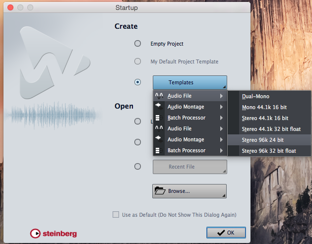
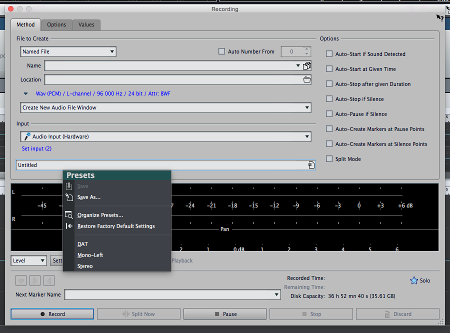
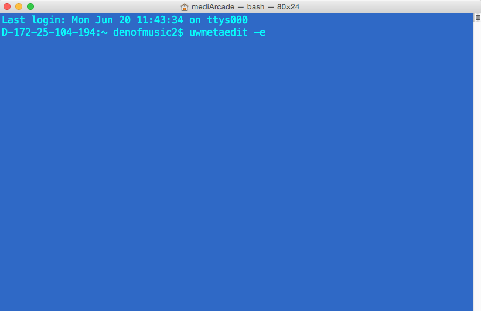
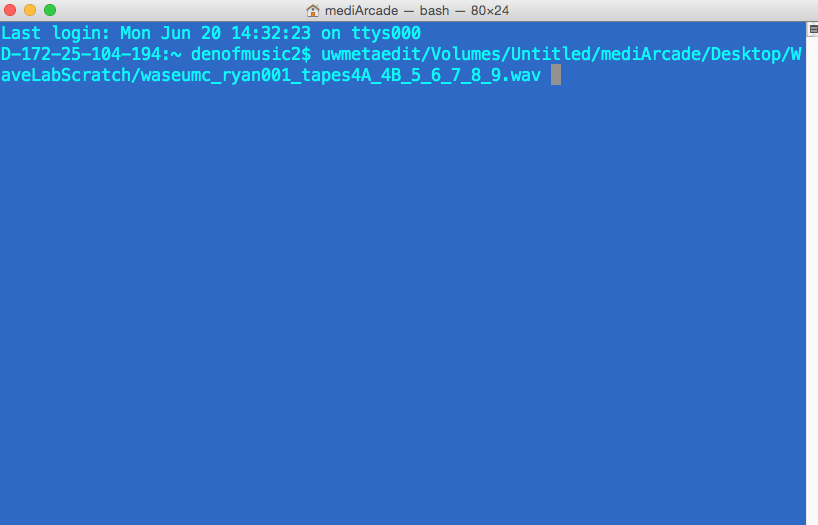
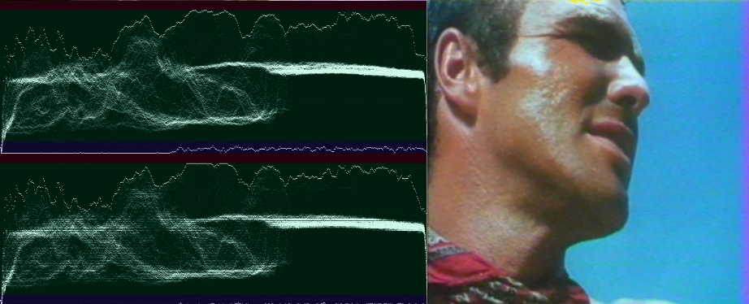
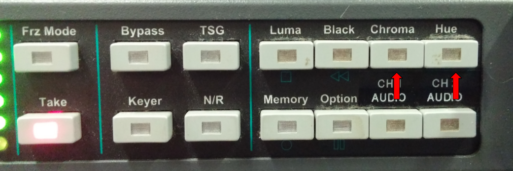
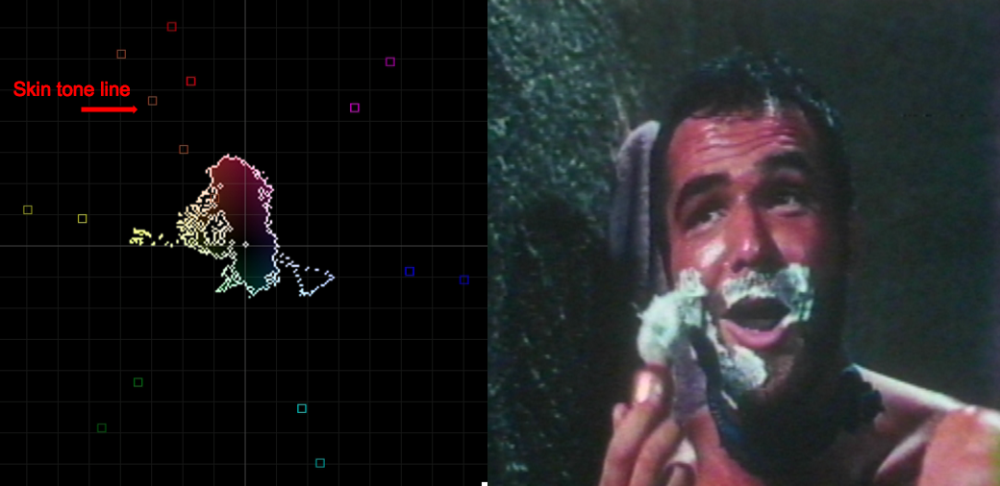
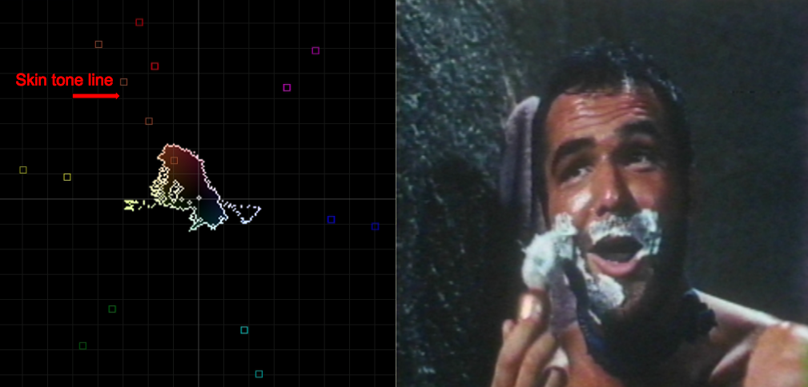

**Video Calibration**

**Update: 7/17/16- **

In the upcoming version of vrecord the scopes have been slightly updated.  The biggest change is that the waveform monitors will now have marked values instead of colored regions.  In using these monitors, the signal should be kept lower than the 235 line (as opposed to the red area in previous versions) and above the 16 line (as opposed to the blue area in previous versions).

Upcoming Scopes

**Interface:**

The ‘Take’ button on the DPS-575 allows you to freeze a frame to aid with calibrating your signal for digitization.  To calibrate for best quality you will adjust ‘Black,’ ‘Luma,’ ‘Chroma’ and ‘Hue’ until the video is within broadcast range.  To exit ‘take’ mode press the ‘exit’ button.  To return any of the settings to zero (you should confirm they are zeroed before you run any tapes) simply press the button (e.g. ‘Hue’) and then press the ‘Default’ button.

**Step 1-Black Levels Keep all levels (within reason- there might be some noise or poorly calibrated scenes)  in the green area of the waveform monitor.  **

**Absolute black should be just above the blue bar.**

**BAD**

**GOOD**

**Step 2- Luma:  Keep all levels (within reason- there might be some noise or poorly calibrated scenes) in the green area of the waveform monitor.  Absolute white should be just under the red bar.**

**BAD**

**GOOD**

**Step 3- Chroma/Hue: Either align to color bars if possible, or find a close up of a face and align from skin tone.  Chroma changes saturation, and hue changes color.**

**BAD**

**BETTER**

