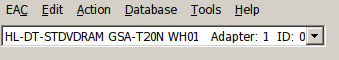

# Optical A/V Media Workflows and Recommendations

## Contents
1. [Overview](#overview)
2. [Audio CDs](#audio-cds-cddas)
3. [DVDs](#dvds)
4. [Appendix A](appendix-a)
5. [Appendix B](appendix-b)

## Overview

Due to the nature of their respective standards, media items that are on optical discs require distinct preservation workflows from other types of digital content. The following information presents workflows and tool examples that facilitate the preferred preservation deliverables of UW Libraries for these formats. 

|Format|Preferred Deliverable|Recommended Tools|
|---|---|---|
|CD-DA (Audio CD)|44.1 kHz/16 Bit Single file (WAV or FLAC) with CUE Sheet|Exact Audio Copy, XLD|
|DVD Video|ISO Disc Image File|Isobuster, ddrescue|

## Audio CDs (CDDAs)


#### Background

Audio CDs (known as CD-DA for Compact Disc Digital Audio) contain a raw stream of audio data with an index and thus can't be 'imaged' in the same way as other digital media. Also - due to compromises made between error correction and storage space, when migrating audio CDs it is important to use specialty software that is capable of multiple passes. (As an example - according to [this paper](https://www.weareavp.com/wp-content/uploads/2014/04/OpticalMediaPreservation.pdf) by AVP, consumer players average about a 5% error rate, so a single pass would risk only accurately capturing 95% of the audio content per disc).

The following workflow will provide recommendations for suitable software, as well as brief notes on other CD-DA specific considerations.

#### Preferred deliverables

Audio CDs should be migrated to a single file containing all audio information, and accompanied by a CUE Sheet file. This CUE Sheet is a plain text document that provides metadata such as in/out times for audio tracks, and naming information if present. (See [sample CUE Sheet](/resources/sample.cue) for an example).

Audio files should be migrated to a lossless format that preserves the original characteristics of the CD Source (16 bit, 44.1 kHz). UW Libraries prefers either uncompressed WAV files, or files losslessly compressed in the [FLAC format](https://xiph.org/flac/).

#### Recommended workflow

The program [Exact Audio Copy](http://www.exactaudiocopy.de/) (EAC) is highly recommended for CD-DA migration. EAC is a Windows program that is free for non-commercial use. While it is native in the Windows system, it can be reliably run on both Linux and macOS via the [WINE Compatibility Layer](https://www.winehq.org/).

Upon first running EAC, it will need to be configured for use with your CD Drive. When you launch it, it will offer options to guide you through the process. A good guide for this process can be found through the [Hydrogen Audio Wiki](https://wiki.hydrogenaud.io/index.php?title=EAC_Configuration_Wizard).

Upon inserting a CD, you will have the option of editing the metadata that will be stored in the CUE Sheet. At minimum, the `Title` field should be assigned to the most appropriate identifier (often the item number for archival materials).

Once metadata entry is complete, to create the desired deliverables of a single audio file with associated CUE sheet, select `Copy Image & Create CUE Sheet` from the `Action` menu. Select `Uncompressed` if generating WAV files, or `Compressed` if you have set up EAC to capture FLAC.


#### Derivative Generation

While Exact Audio Copy can be used to split Wave files with CUE sheets into individual tracks (by selecting `Split Wave by CUE Sheet` from the tools menu, it is recommended to use a different tool that enables compression for derivative generation.

One such tool that works well for this purpose is [CUE Tools](http://cue.tools/wiki/CUETools_Download). Within CUE Tools, after selecting the desired input and output locations, set `Action` to `Encode`, `Mode` to `Tracks` and `Audio Output` to `Lossy` (while selecting mp3 from the dropdown menu). Pressing `Go` will begin the splitting and transcoding of your FLAC or WAV master file into track based derivative files.


### Additional CD-DA Considerations

#### CD Drive Offsets

Different CD drives start their playback with slightly different offsets of samples. This means, that if it is desired to verify the integrity of a transfer by using checksums to compare against other transfers of the same disc (such as through a database like [Accuraterip](http://www.accuraterip.com/)) this offset must be established and the transfer software must be calibrated accordingly.

If using Exact Audio Copy, the drive model information will appear in the upper left corner of the window:



This model number can then be used to search in the [Accuraterip list of drive offsets](http://www.accuraterip.com/driveoffsets.htm).


#### CD Pre-emphasis

Some CDs were created using frequency emphasis that must be accounted for and reversed on playback for correct sound. (This is analogous to the [RIAA curve](https://en.wikipedia.org/wiki/RIAA_equalization) used on LPs and their need to be played back with a phono preamp). CD Players that are standards compliant will be able to detect emphasis, however this will not automatically occur during any migration. This is relatively rare, and occurs mostly on older CDs from the 1980s. Nonetheless, it should be considered when planning any migrations that might contain affected materials. Should an example of a CD containing pre-emphasis be desired, [_Can't Slow Down_](https://alliance-primo.hosted.exlibrisgroup.com/permalink/f/kjtuig/CP71148760790001451) by Lionel Ritchie is available in the UW Libraries Collection.

To accurately preserve both the contents of the optical disk, as well as the intended presentation experience of the CD, if a CD contains pre-emphasis two versions of the content should be created. A 'flat' version of the CD should be migrated, with the appropriate flags indicating pre-emphasis contained in the associated CUE sheet. Any CDs reproduced from this combination will play correctly with de-emphasis applied. In addition to this, a digital listening copy should be created that has had a de-emphasis filter applied. For methods to do this, see [Appendix A](#appendix-a).

## DVDs

#### Background

To capture the content of a video DVD, an ISO disc image file should be created (as opposed to loading the disc and then copying the VOB video files off). This allows for better handling of any errors in the disc, as well as facilitates both easier playback and derivative generation. If an ISO image of a DVD is played back using software such as VLC, not only the video but things like the menu will be viewable in a close approximation of their original format. Additionally ISO images can be used as inputs for tools such as Handbrake to create access MP4s as desired.

#### Preferred deliverables
A single ISO disc image file should be created for each DVD. This ISO should be named according to a convention that allows it to be associated with the original item (for example Item_Number.iso).

#### Recommended workflow

__Linux Environment (Such as Bit Curator)__

* Readom
* DDRescue


__Isobuster__


#### Derivative Generation

ISO disc image files can be used as inputs for the popular DVD Ripping program [Handbrake](https://handbrake.fr/). To create an access MP4, open you ISO file in Handbrake in the same manner as a DVD.

#### Appendix A
There are several methods to apply a de-emphasis filter. If the CD is still available, ripping it via the Apple iTunes software will automatically create a de-emphasized version. If de-emphasis needs to be applied to an already existing file, the following are two options.

__FFmpeg__

The media manipulation tool [FFmpeg](https://www.ffmpeg.org/) contains an EQ filter that can reverse emphasis with the following command: `ffmpeg -i input_file.wav -af aemphasis=type=cd deemphasized_file.wav`

Command from [ffmprovisr](https://amiaopensource.github.io/ffmprovisr/#cd_eq).

A de-emphasis curve can be added to the popular tool [Audaciy](https://www.audacityteam.org/), which can then be applied to a target file.

The following text should be added to the Audacity configuration file EQCurves.xml

```
<curve name="RedBookPre">
<point f="700.000135021151" d="0.000000000000"/>
<point f="1000.101652520304" d="-0.500512741089"/>
<point f="1950.142416511543" d="-1.398496627808"/>
<point f="3000.068564380608" d="-2.502575836182"/>
<point f="5000.000948851137" d="-5.004147338867"/>
<point f="10000.005928346302" d="-7.520062176514"/>
<point f="20000.322508988818" d="-9.504367828369"/>
</curve>
```
The file can then be edited in audacity and the new curve applied via the 'Equalization' effect.

Curve was created using the information in [this paper](https://web.archive.org/web/20170704181101/https://audioxpress.com/assets/upload/files/galo3025.pdf) by a user in the [Audacity Forums](https://web.archive.org/web/20200402221556/https://forum.audacityteam.org/viewtopic.php?t=9141).

### Appendix B

[Yale Alice Prael Paper](http://campuspress.yale.edu/borndigital/2016/12/20/to-image-or-copy-the-compact-disc-digital-audio-dilemma/)

[NYU Annie Schweikert Paper](https://archive.nyu.edu/bitstream/2451/43877/2/Schweikert_OpticalMediaPreservationNYU_2018.pdf)

[Johan Van Der Knijff paper](https://researchkb.wordpress.com/2015/11/13/preserving-optical-media-from-the-command-line/)
